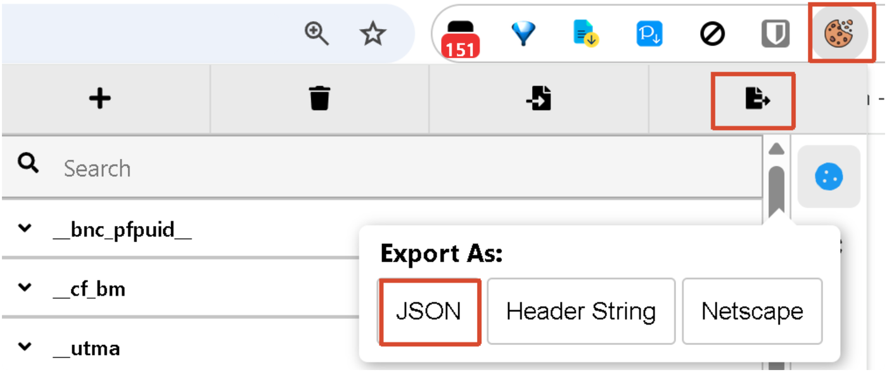
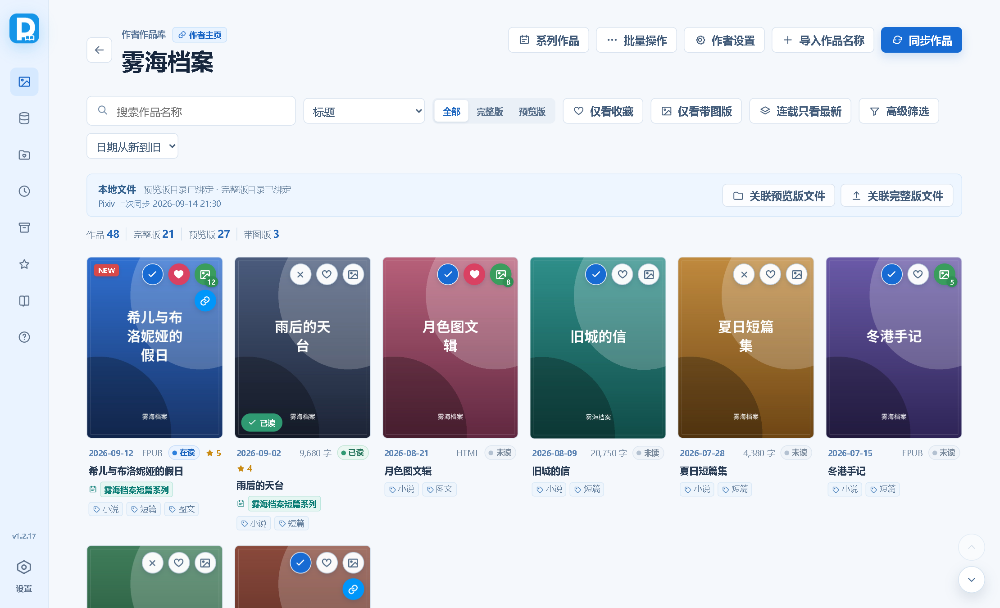
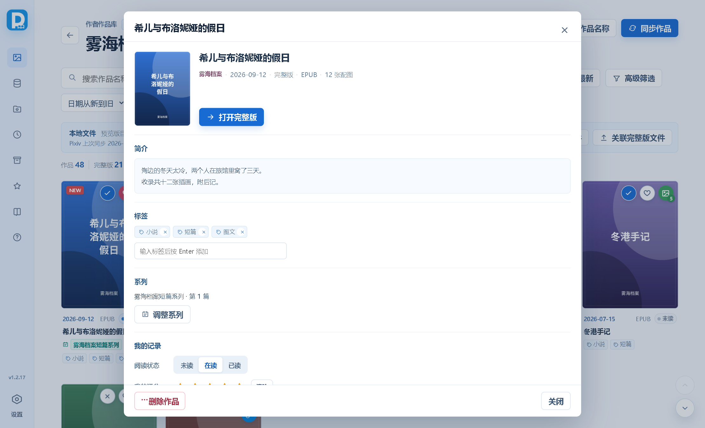
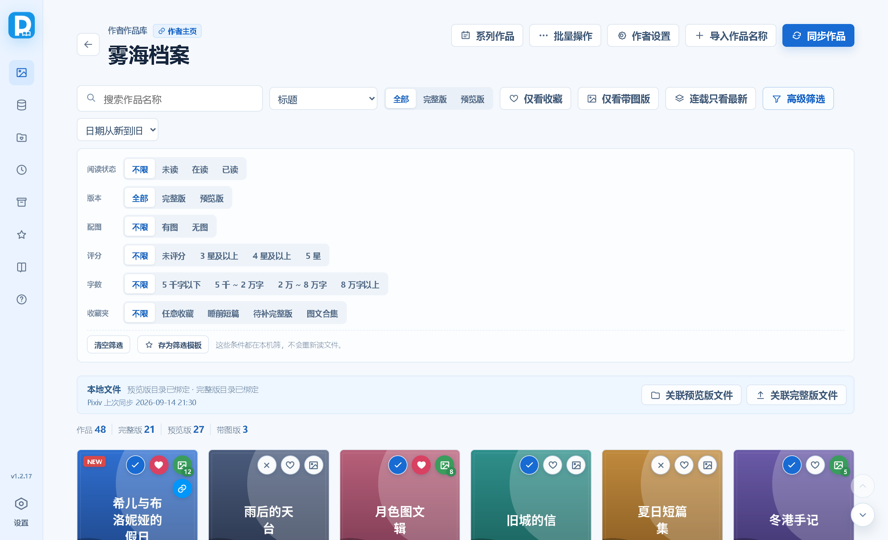
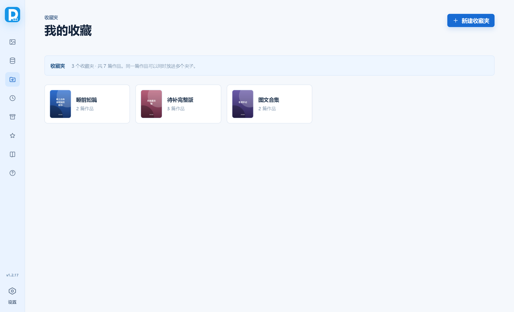
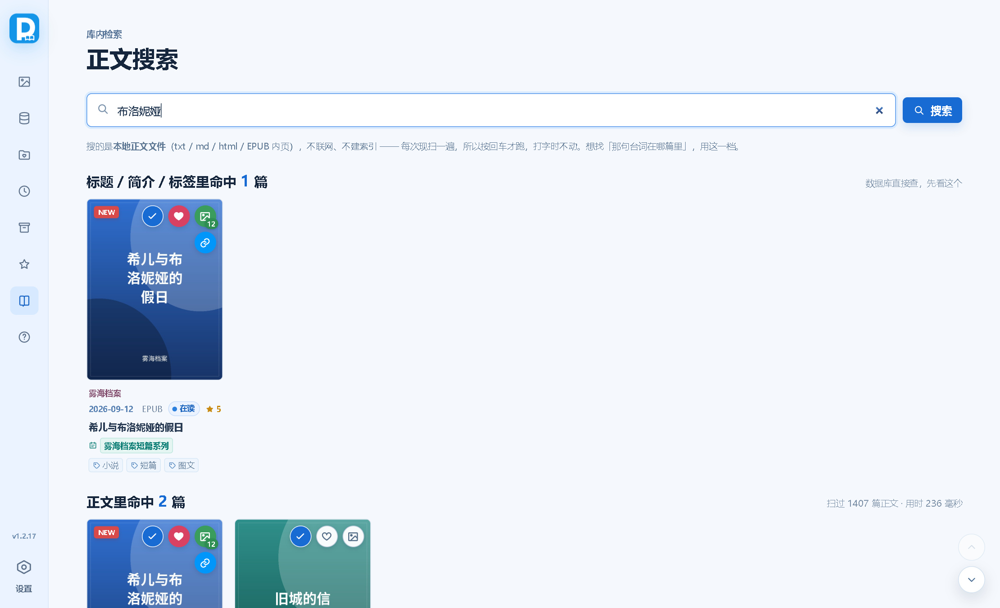

# Pixiv小说下载管理器

Windows 本地作品管理软件，用于按作者管理 Pixiv 小说预览版与完整版文件，记录购买状态、封面、标签、系列、收藏与阅读记录。

> **图文使用帮助：[docs/index.html](docs/index.html)** —— 带界面截图的分步说明（安装、设置、Cookie、同步、关联文件、作品详情、搜索与筛选、收藏夹、系列、待补完整版、常见问题）。
>
> 同一份内容也内置在软件里：点左下角侧栏的「帮助」直接看，不用另外开浏览器、也不依赖网络。
> 内容只维护一份 —— `docs/index.html` 是唯一来源，构建时由 `scripts/build-help-doc.mjs` 编译进程序。

## 功能

- **作者库与作品库**：作者卡带作品 / 完整版 / 带图版 / 收藏统计、新增角标与上次同步时间；作者可拖动排序、可标特别关注
- **作品详情页**：简介（HTML 净化 + 外链可点）、标签就地增删、系列调整、阅读记录（未读 / 在读 / 已读 + 五星星评分 + 一句话笔记）、收藏夹、文件与 Pixiv 操作全在一处
- **同步 Pixiv 小说**：正文、封面、投稿日期、标签、系列一次拿下来；按原始投稿时间筛选、增量同步、进度、终止、抓取限速与限流退避；封面落盘前自动压一道
- **关联本地文件**：相似度匹配、角色名匹配、完整版自动分组、批量设为完整版；支持文本、电子书与 HTML
- **库内正文全文检索**：「正文搜索」页现扫本地正文文件（txt / md / html / EPUB 内页），命中处带上下文片段与高亮，不建索引、不联网
- **搜索与筛选**：搜索范围五档（标题 / 标题+简介 / 标题+简介+标签 / 标签 / 正文内容）；高级筛选六行（阅读状态 / 版本 / 配图 / 评分 / 字数 / 收藏夹）；条件可存成「筛选模板」复用
- **收藏夹与浏览历史**：收藏夹可建多个、一篇作品可同时进多个夹子；浏览历史按天分组
- **系列作品**：系列总览显示缺口序号与阅读进度、一键继续读、可把整个系列合成一本 EPUB
- **待补完整版工作台**：按作者摊开「只有预览版」的作品，标过「已找过·没有 / 不打算补」的不再重复出现
- **导出与打包**：作品清单导出 CSV / Markdown（含封面路径、作品 ID、配图张数、简介）；收藏夹或系列可合成为一整本 EPUB
- **键盘操作**：全局快捷键、列表页方向键导航、空格切已读
- 选中作品标题一键跳到自配的完整版/补档网站搜索页
- **内置自动更新**：查到新版本一键下载并重启，旧版本自动送进回收站；GitHub 连不上时自动走加速镜像
- 便携式 SQLite 数据库，数据保存在程序目录旁的 `data` 文件夹；每天首次启动自动备份一份

## 推荐工具

- 小说本地阅读器：[Koodo Reader](https://www.koodoreader.com/zh)
- 获取 Cookie 的浏览器扩展：[导入cookie](https://chromewebstore.google.com/detail/import-cookies/iglhfgmnhldgoogomfjljbdgkgdgmedn)
- 将 Pixiv 图文小说转换为 EPUB 的油猴脚本：[Pixiv小说Epub合成器](https://greasyfork.org/zh-CN/scripts/483999-pixiv-novel-to-epub)

## 操作指南

### 1. 首次设置

1. 启动程序后，点击左下角“设置”。
2. 设置预览版、完整版默认目录；需要自动创建作者目录时，打开“自动创建作者目录”。保存作者后，程序会按作者名称自动创建并绑定两个目录。
3. 设置“最小文件大小”，导入和 Pixiv 同步会跳过小于该阈值的 TXT 文件（文件夹本身不受此限制）。
4. 在“Pixiv Cookie”中直接粘贴 Cookie，或从文件导入。程序只保存 Pixiv 接口所需的 `PHPSESSID`。
5. “排除标签”用中英文逗号分隔，包含这些文字的标签不会写入作品记录。
6. 默认在同步作品超过 150 篇时，每篇详情请求间隔 1 秒；可按需要调整以降低连续抓取频率。**「补抓作品简介」也吃这个设置**；连续失败时间隔会自动翻倍（最多 60 秒），连续失败过多会提前停下。
7. 设置项按用途分成 6 块，每块左边有一条自己的色带、标题前有序号，不用再从头翻到尾：
   - **Pixiv 账号**：Cookie、排除标签、抓取间隔，以及 **Cookie 体检**（见 [第 2 节](#2-cookie-获取)）。
   - **文件与目录**：最小文件大小、三个目录、自动创建作者目录。
   - **匹配与关联**：两个相似度阈值、匹配作品名长度、常见角色名列表（匹配相关全在这一块）。
   - **下载与图文**：配图画质、图文小说保存格式。
   - **搜索网站**：填网站名和搜索页网址，作品卡右键菜单里的「在 XX 搜索选中文字」就按这里的配置生成（见 [完整版搜索网站](#完整版搜索网站)）。
   - **维护与数据**：软件更新、浏览历史、自动备份，以及补抓作品简介 / 补齐失效封面 / 检查文件是否还在 / 清理多余预览版 / 导出与恢复备份这些一次性动作。
8. **设置没有保存按钮，改完自动保存**：停手半秒就写进数据库，页脚那行会显示「已自动保存 21:35:02」；填到一半的、通不过校验的值不会存进去，页脚会红字写明原因（比如网址少了 `=`），改对了就自动存。弹窗关掉时也会把没落盘的改动先写掉，不用担心白改。
9. **自动备份**：每天第一次启动时把数据库备一份到 `data/backup/auto`，默认保留最近 7 份（可改成 1–50）。滚动清理**只删这个目录里程序自己生成的备份**，你手动导出的备份不会被动。备份列表就在设置里，每一份都能直接点「恢复这一份」。

### 2. Cookie 获取

> [!CAUTION]
> **Cookie 等同于登录凭据，必须先有它才能同步。** 请勿发送给他人、公开截图或提交到 GitHub。Cookie 通常会在 1-2 周后过期；同步失败时请重新导出。下载 R-18 内容需要有效的登录 Cookie。

没有 Cookie，作品列表、正文、封面都取不下来，同步会失败或只拿到一小部分作品。获取后，将内容粘贴到软件“设置 → 1 · Pixiv 账号”中的 **Pixiv Cookie** 输入框即可（设置改完自动保存，没有保存按钮）。

#### 方法

三个红框就是要点的地方：**扩展图标** → **导出按钮** → **Export As 选 JSON**。

1. 用 Chrome 或 Edge 打开 <https://www.pixiv.net> 并登录账号（要取 R-18 内容必须处于登录状态）。
2. 使用支持导出 Cookie 的浏览器扩展，例如上方推荐的“导入cookie”（Cookie-Editor、EditThisCookie 等同类扩展操作也差不多）。
3. 点扩展图标打开 Cookie 列表，找到 `www.pixiv.net` 那一组，点导出按钮，**Export As 选 `JSON`**。
4. 将全部文本粘贴到软件“设置”中的 Pixiv Cookie 输入框（或点“从文件导入”选那个 `.json`），改完自动保存。

**关于导出格式**：`JSON` 和 `Header String` 都被接受（后者就是浏览器开发者工具里复制的 `PHPSESSID=xxxx; other=yyyy` 那种一行文本；只粘 `PHPSESSID=…` 一段也行）；**`Netscape` 不行**，那是制表符分隔的格式，程序认不出来。整段内容都粘进去没关系 —— 程序只挑出 Pixiv 登录所需的 `PHPSESSID` 存进数据库，其余读完即弃，不会外传；若整段里找不到 `PHPSESSID`（比如贴错了别站的 Cookie 或没登录），会直接报错且不保存。

#### Cookie 体检

填完不用等同步跑到一半才发现不对 —— Cookie 输入框下面有个「**测试 Cookie**」按钮：

- 它拿**当前框里填的那一份**向 Pixiv 发一个只读请求（框里空着时测的是已保存的那份），所以刚粘贴完就能点，不用等自动保存那半秒。
- 有效 → 绿字给出**登录的账号名**，方便确认换的是不是想要的那个号；同时当天不再弹启动提醒。
- **失效 / 没填 / 连不上分别给不同的说明**：失效该重新导出一份，连不上该去查网络或代理，没填只是还没设置。不会一律糊成一句「失效了」让你白折腾。

程序每次启动也会自动验一次，**只在「已失效」时提醒**（每天最多一次）；从来没填过不会弹 —— 那属于还没设置，不是坏了。Cookie 失效只影响 R-18 作品和完整作品列表，不影响本地已有的文件。

> 更细的图文步骤见 [docs/index.html](docs/index.html) 第 3 节。

### 3. 新建作者

1. 在“作者库”点击“新增作者”。
2. 填写 Pixiv 作者主页后，点击“同步作者信息”会自动读取作者名称和头像。
3. 配置了默认目录和自动创建作者目录时，直接保存作者即可自动生成预览版、完整版目录；也可以手动选择目录。
4. 设置“关联相似度”。文件名不完全相同时，达到该分值才会作为自动关联候选。

作者头像右上角的橙色数字表示**上次同步之后新发现的、还没打开过的作品数**（超过 99 显示 `99+`，鼠标停上去看完整说明），卡上还带一句「上次同步 …」。

**“关联相似度”到底在比谁**：一侧是**作品标题**（Pixiv 同步下来的，或本地导入时取的名字），另一侧是**本地文件名**。算分是把两边各自归一化（去掉扩展名、去掉开头的日期、只留字母数字并把大写转小写）后，取**最长的一段连续相同文字**，再除以**两边里更长的那一边的字数**：

- 标题 `ABCD`、文件名 `AB` → `2 ÷ 4 = 50%`；
- 标题 `ABCD`、文件名 `CD` → 也是 `50%`（只要那一段连着出现就行，圆括号一样的“跳字匹配”不算，`AD` 只有 `25%`）；
- 标题 `ABC`、文件名 `ABCDEF` → `3 ÷ 6 = 50%`：文件名多出来的字同样要扣分。

谁的名字长就按谁算，两边多出来的内容都会拉低分数。所以文件名里带日期、“完整版”这类前后缀时会掉分，掉到“关联相似度”以下就不会自动关联 —— 想宽松些就把“关联相似度”调低一点。

**“匹配作品名长度”这个设置只在标题比文件名长时有用**：填十几二十个字，就只拿标题开头那一截去比，分母跟着变小、分数上来。反过来文件名比标题长时，分母恒定是文件名长度，截标题只会让分子变小，这个设置就不起作用了。

**作者卡的顺序可以自己排**：每张作者卡名字右边有个六个点的**拖动按钮**，按住它约 0.2 秒卡片就被“拿起来”——你会看到一张跟着鼠标走的卡片浮在最上层（微微倾斜、带投影），原位置留下一块半透明的虚位；把它挪到别处时，其余卡片会顺势滑开给你让位，松手放下就排好了，顺序存进库里、下次打开还是这样。轻轻点一下（不到 0.2 秒）不会触发拖动，也不会误进作者作品库。没拖过的作者按名称排，并且一律排在拖过的作者后面。

### 4. 同步 Pixiv 小说

同步前必须设置预览版和完整版目录，并在“设置”中保存有效的 Pixiv Cookie。

#### 批量同步作者小说

1. 在作者设置中填写 Pixiv 作者主页。
2. 在作者作品库点击“同步作品”。
3. 填写开始、结束日期时，按 Pixiv 原始投稿日期筛选；两个日期留空时，只检查上次成功同步之后的新投稿。
4. 同步会保存小说正文、封面、标签和系列信息。预览版目录里已经有一份**名字完全相同**的文件时会优先关联，不重复下载（只有名字一模一样才算，不会拿「其一」顶「其二」）。
5. 同步会显示进度，可点击“终止同步”。未终止且没有失败作品时才会更新“上次成功同步”时间。
6. 从 Pixiv 下来的封面在落盘前统一压一道（界面里从没按原尺寸显示过，压完看不出区别），一张封面从两百多 KB 降到几十 KB。

#### 同步单篇小说

1. 在“同步作品”窗口的“单篇小说地址”中填入，例如：`https://www.pixiv.net/novel/show.php?id=28686066`。
2. 点击“开始同步”后，只会同步该小说，不读取作者主页作品列表。
3. 单篇同步不使用日期范围，也不会更新“上次成功同步”时间。

简介里含“全文”（“全文放出”除外）或含“购买”时，作品会保留为预览版；其他简介会判为完整版。

一个作品只占一边：判为完整版的，正文、封面、配图和图文版整份放进完整版目录；判为预览版的，整份留在预览版目录。同步不会在两边各放一份。

#### 简介会顺手存下来

同步本来就要读一遍简介来判断预览版还是完整版，所以顺便存进库里，之后在作品详情页能直接看到，不用再多发一次请求。老作品（同步时还没存简介的那批）可以到“设置 → 6 · 维护与数据 → **补抓作品简介**”补一次 —— 它会跳过已经有简介的，也会跳过上次问过、确认「作者根本没写简介」的；点之前先体检，一篇都没得补时直接告诉你，不会白起一次进度浮层。

#### 图文小说（正文带插画）

Pixiv 有些小说把插画直接插在正文里（正文里是 `[uploadedimage:数字]` 这样的占位符）。同步这类作品时，软件会把配图一起下载到正文同名的 `{标题}_images` 文件夹，并按顺序编号，同时把正文里的占位符换成 `[插图 3：标题_images/003.jpg]` 这样的指引，另外生成一份阅读版（格式由设置决定）：封面、章节、注音和插图都排好版，直接就能看图文原貌。

- 配图画质在“设置 → 配图画质”里选：默认 1200 宽（每张约 1 MB），也可以要作者上传的原图（可能是几 MB 的 PNG）。
- 阅读版格式在“设置 → 同步作品时图文小说自动保存为”里选：**HTML**（默认，双击用浏览器打开）或 **EPUB**（适合推到手机 / 阅读器）。同步时只生成选中的这一种，不会两种都存。
- 三个下载入口（重新下载 HTML / EPUB / TXT 版并绑定）都在**作品详情页的「Pixiv」块**里，见 [第 6 节](#6-作品卡与作品详情)。
- 作者作品库进入“批量操作”勾选作品后，「文件」组里有 **“补下配图”**（按设置里选的格式批量跑上面那套流程，带进度条）和 **“重新下载 EPUB 版”**（不管设置，批量出 EPUB）。
- 作品卡上的带图角标显示这个作品有几张图：下载过配图就是实际下载的张数；作品绑定的是 **EPUB / HTML** 时，软件会直接数文件里的插图（封面不算），所以外面带进来的电子书也有角标。关联完整版文件、自动分组、换绑定的当下就会更新；老作品可以到“设置 → 阅读版图片数 → 立即重算”补一遍。

### 5. 关联本地文件

在作者设置中指定预览版、完整版目录后，可在作者作品库中操作：

- **关联预览版文件**：扫描预览版目录第一层。已有作品未关联时会自动绑定；作品库中没有的预览版文件会新增为作品并绑定。
- **关联完整版文件**：点击后先选匹配方式（见下一小节），然后扫描完整版目录第一层；**已经关联过的文件直接跳过**（同步时下下来就绑好的那些不会再让你绑第二遍），封面图与配图文件夹不参与；有歧义时可手动选择目标作品（弹窗里的文件名过长会省略显示，鼠标悬停可看完整路径）。想给已绑定的作品换文件，用**作品详情页「文件」块底部的「绑定完整版文件」**。
- **手动关联完整版文件**：点开作品详情（作品卡右下角「⋯」或右键），“文件”块底部有“绑定完整版文件”。
- **能参与关联的只有文本（txt / md）、电子书（epub / mobi / azw3 / pdf…）和 HTML**。封面图（jpg、png…）与 `{标题}_images` 配图文件夹一律不参与关联 —— 完整版目录里的封面不会被列进候选，自动分组也不会把封面当成作品搬走。
- **批量设置为完整版**：进入批量操作并勾选作品，把预览版文件（含配图文件夹和图文版）移动到完整版目录后自动绑定，预览版目录不再保留副本。
- **完整版自动分组**：“设置 → 2 · 文件与目录 → 完整版自动分组文件夹”指定一个待整理目录，程序会把里面（含子文件夹）的文件按作者挪到对应的完整版目录去。

#### 匹配角色 / 匹配标题

点“关联完整版文件”或“完整版自动分组”（含“指定作者自动分组”）后，会先让你选这次用哪种方式匹配：

- **匹配角色**：从文件名里抽角色名，和作品标题里的角色名取交集。只要有一个角色名对得上就算候选，**不管标题像不像、也不看相似度阈值**。适合文件名只有“作者名 + 角色名”、跟作品标题对不上的情况。这个模式下**不会自动绑定**，每一条都由你手动确认，下拉框括号里会写明命中的角色名。
- **匹配标题**：原来的方式，按文件名与作品标题的相似度匹配，达到“关联相似度”就自动绑定。

两种方式都遵守同一条作者规则：**文件名里写明了作者（例如 `【作者：AAA】甘雨同人.txt`），就只在这位作者的作品里匹配。**

**文件名里的作者不在作者库里**时，这些文件不参与匹配，而是按作者名分组、列在弹窗最下方（组下面是文件名，不给下拉框），方便你先去把作者加进作者库再回来匹配。如果写的作者是库里**另一位**作者，说明这个文件不属于当前作者的目录，会被直接跳过（想把它归到别人名下，用“完整版自动分组”）。

需要手动选择时（一个文件匹配到多个作品、或按角色匹配），弹窗里**默认不勾选任何作品** —— 相似度达标也只是打个“推荐”标记，勾哪几个由你决定。只有**“指定作者自动分组”**这条路例外：唯一达标候选会预先勾上（范围只限这一位作者的作品，命中更可信）。勾选 1 个作品＝移动文件，勾选多个＝复制多份。候选作品的目录里已经存在同名文件时，处理方式默认是**覆盖原文件**，也可以改成跳过或保留两份。

角色名列表在“设置 → 常见角色名列表”里维护：内置 8 款热门游戏（原神、崩坏：星穹铁道、崩坏3、绝区零、鸣潮、碧蓝航线、蔚蓝档案、明日方舟）的热门角色，按游戏分组。可以往任意分组里加角色（支持别名，用 `|` 分隔）、新建分组、改名、删角色、删整个分组；**点角色名可以临时停用**（划掉的那个不参与匹配），点 × 删除。游戏名只负责归类，不参与匹配。

### 6. 作品卡与作品详情

卡片上有什么：

- 点击作品会优先调用本地阅读器打开完整版；没有完整版时打开预览版。完整版为 TXT 时显示字数，绑定 EPUB、HTML 等其他文件时显示文件格式。
- 只有**封面图**和**标题**能打开文件，卡片其他位置（日期、标签）点了没反应。所以标题可以放心用鼠标拖动选中、或双击选词，再按 Ctrl+C 复制 —— 拖选和双击选词之后都**不会误触打开文件**。
- 封面左上角的 **NEW** 角标表示这篇是同步之后新发现、还没打开过的作品。
- 封面第一排的**状态 / 收藏 / 带图版**三个徽标都能点：状态徽标在未读 / 在读 / 已读之间循环，心形打开收藏夹选择器，带图版徽标切换标记。第二排是**「打开作品网址」**（链接图标，**只有这篇作品有 Pixiv 作品 ID 时才出现**），点了用系统默认浏览器打开这篇作品的 Pixiv 页面。
- 封面**左下角**那个圆钮是「**标为已读**」—— 未读和已读之间一步切换（鼠标停上去或已读时才显示）。和状态徽标的区别是：状态徽标从“已读”再点会掉回“未读”，想连着标一批时不好用；这个只往前不往回。
- 标题下面那行小字是**日期 · 字数或格式 · 带图张数 · 已读状态 · 评分**；再下面是系列名（如果有）和标签。

#### 打开作品详情

两个入口，去的是同一个地方：作品卡右下角的 **「⋯」**，或者在卡片上**右键**（没选中文字时）。收藏夹、浏览历史、「所有作品」里的卡片也一样能开。

详情页从上到下是一块一块的：

- **头部**：封面、标题、作者（可点，直接跳到那位作者的作品库）、日期 / 完整版还是预览版 / 格式 / 配图张数，以及唯一那个**「打开完整版」/「打开预览版」**按钮。
- **简介**：超过三行会折叠。Pixiv 那边简介是 HTML（` `、`<a href>`…），软件在**显示层**净化的同时把链接还原成可点链接（站外的跳转页也会解回真实地址），点了走系统浏览器 —— 库里存的仍是 Pixiv 原文，所以已经抓回来的老数据会自动跟着好，不用重抓。空简介分两种：**「作者没写简介」**＝已经问过 Pixiv，那边本来就没有；**「这篇还没有简介」**＝还没问过，去“补抓作品简介”能拉一次。
- **标签**：就地编辑 —— 每个标签右边有个 × 直接删，下方输入框敲回车就加。改一下存一下，没有“保存标签”按钮。
- **系列**：显示“系列名 · 第 N 篇”，点“调整系列”加入系列、改序号，或者**退出这个系列**（红色按钮，只在作品本来就在系列里时出现）。
- **我的记录**：阅读状态、五星星评分（再点“清除”取消）、一句话笔记（最多 200 字，失去焦点就保存）。
- **收藏夹**：显示已收进的夹子，点“调整”改（一篇可以同时放进多个夹子）。
- **文件**：完整版 / 预览版 / 阅读版 / 封面四条路径，每条旁边有“打开”和“所在目录”；下面一排是“设为完整版 / 设为预览版”“绑定完整版文件”“设为带图版 / 取消带图版”。**「打开所在目录」会顺手在资源管理器里把这份文件选中**，不用自己在一堆文件里找。
- **Pixiv**：作品 ID 和“在浏览器里打开原页”，以及三个**“重新下载 HTML / EPUB / TXT 版并绑定”**。
- **弹窗页脚左侧**是“删除作品”（危险动作放角落，有二次确认）。

**三个“重新下载 … 版并绑定”**都会抓一次 Pixiv 最新正文、把没下过的配图补齐、生成阅读版，然后**把作品绑定到新文件上**——预览版 / 完整版的属性不变，只是以后“打开作品”打开的是它。重复点也安全：配图不重复下，等于原地重新打包。TXT 版出的是纯文本（正文里的插图写成 `[插图 N：{正文名}_images/001.jpg]` 指引），完整版常年在别的站下载、未必顺手带一份 Pixiv 原版正文时用得上。没有 Pixiv 作品 ID 的作品抓不到，会提示先同步。这些按钮**不管设置里选的阅读版格式**，点哪个出哪种。

#### 阅读状态是怎么定的

软件只能观测到“打开过”——作品是用外部阅读器打开的，读没读完它收不到任何信号。所以：

- **未读**＝从没打开过（软件自己知道）；
- **在读**＝打开过、但还没手动标已读（打开时会自动标上，永远**不会把已读打回在读**）；
- **已读**＝**只能你手动标**（封面左下角圆钮、状态徽标循环、详情页里选，或批量操作一次标一批）。

没有百分比进度条 —— 真实进度它测不到，做出来是假数字。

#### 右键：两种菜单

- 在作品卡上**选中文字后再点右键**，弹出的不是详情，而是一个**搜索菜单**：把你选中的那截文字丢到设置里配好的网站上搜去。「在 `书香` 搜索选中文字」这样的入口按配置顺序往下排，网站名高亮，点一下就用**系统默认浏览器**打开那个站的搜索页，关键词就是你选中的那截文字。菜单顶上先亮一行「搜这段文字：xxx」，选错了一眼就能看出来。
- **没选中文字时右键**，直接开**作品详情**（和点「⋯」一样）。

一个网站都没配的时候，搜索菜单里直接给一个「还没配搜索网站，点这里去添加」，点了就打开设置并滚到「搜索网站」那一块，光标落在输入框上。

#### 完整版搜索网站

完整版常年在别的站下载的话，不用再手动复制标题去搜：

1. 打开“设置 → 5 · 搜索网站”，点“添加网站”。
2. 左边填网站名（比如 `书香`），右边填它的**搜索页网址**。
3. 网址的规矩很简单：**最后一个 `=` 后面就是搜索词的位置**，程序会自动清掉那后面的内容，搜索时换成你选中的文字。
4. 想加几个站就加几个，右键菜单按列表顺序往下排；不想要某项就点那行的 ×。

**网址填得不对也没关系，程序会自动清洗**（输入框一失去焦点就改，并在那一行下面写明改了什么）：

- **搜索结果页的地址**（很多 Discuz 系论坛搜完之后地址栏会变成一大堆参数）会被自动收成能换词的搜索地址。关键是里面的 `searchid` —— 那是**那一次搜索的缓存编号**：服务端存下当时命中的帖子列表，结果页靠它取结果，`kw` 只用来高亮标题。所以关键词换成什么，出来的还是当初那一批；缓存过期后地址还会失效。
- 清洗时**只动这几个地方**：去掉 `searchid`、把关键词参数（Discuz 用 `srchtxt`）挪到最末一位、Discuz 缺 `searchsubmit=yes` 时补上。其余参数**一个都不动、顺序也不变**。
- 比如粘 `https://sxsy45.com/search.php?mod=forum&searchid=83552&orderby=dateline&ascdesc=desc&searchsubmit=yes&kw=图`，会被收成 `https://sxsy45.com/search.php?mod=forum&orderby=dateline&ascdesc=desc&searchsubmit=yes&srchtxt=` —— 板块（`mod`）和按时间排序（`orderby`、`ascdesc`）全都留着，搜索词照旧填在最后那个 `=` 后面。
- 老版本存下来、还带着 `searchid` 的网址，打开设置时会自动清好并落盘，不用自己重填。

搜索词会自动做 URL 编码（中文、空格、`&`、`+` 都能正确带过去），不会因为标题里带符号就把参数截断。

### 7. 浏览、搜索与批量管理

- 可按预览版/完整版、收藏、连载和发布日期筛选、排序。
- 排序可选：日期从新到旧 / 从旧到新、名称 A-Z、**字数从多到少**、**评分从高到低**。字数这条把 **EPUB、HTML 这类阅读版按配图张数**排，并且**整体排在 TXT 前面**（图文作品通常就是最想先看的），TXT 之间再按字数排。
- **搜索范围可切五档**：标题（默认）、**标题 + 简介**、**标题 + 简介 + 标签**、标签、**正文内容**。库里存的是 Pixiv 上的整篇简介，想按设定、情节找作品时中间两档比只搜标题有用得多；选“正文内容”时要按回车（要扫本地文件，见 [第 11 节](#11-正文搜索)）。
- **连载只看最新**：同一前缀的连载作品只保留章节号最大的那一篇，按钮上会写清折叠掉了几篇。
- “仅看收藏”在作者作品库与“所有作品”中分别保存，不会互相影响。
- “所有作品”汇总全部作者的作品；**卡片上的作者名可以点**，点了直接跳到那位作者的作品库（会清掉当前的搜索词与“仅看”筛选，落到干净的列表）。跳进去以后左上角的返回箭头会**回到“所有作品”**，并且把离开前的搜索词原样还原；从侧栏进作者库再点作者卡进去的，返回箭头照旧回作者库列表。卡片封面第一排的三个徽标这里也有，并且跟作者作品库里一样可以直接点 —— 标记是同一份数据。
- **列表分页加载**：库里上千篇时不会一次全铺出来，先显示一批，滚到底自动接着加载（页脚也有“再加载”按钮兜底），页脚会写“已显示 N / 共 M”。改筛选条件后会退回第一批。
- **界面位置会记住**：上次停在哪个页面、那页的搜索词 / 筛选 / 排序、滚到哪儿，下次打开接着看（超过一个月没动过的位置不再还原）。
- 批量模式下支持拖框选、全选、删除和设置版本 / 阅读状态 / 评分 / 收藏夹 / 标签；所有删除操作均有二次确认。

**批量工具条**按用途分成四组加一个危险动作：**版本**（设为完整版、设为带图版）、**整理**（设已读 / 设未读、设评分、加入收藏夹、移出收藏夹、改标签）、**文件**（补下配图、重新下载 EPUB 版）、**输出**（导出清单），右边贴边是**删除已选**。

- 「加入收藏夹」是**并集**，只加不减；「移出收藏夹」是另一条独立的路 —— 所以“加入”不会把作品从别的夹子里踢出去。
- 标签只能**追加 / 移除**，不做整体替换：一次手滑毁掉一批标签太难收拾。
- 两个批量动作（设评分 / 移出收藏夹）做完会自动退出批量模式并清空选择，想接着做第二个要重新进一次。

### 8. 高级筛选与筛选模板

工具栏右侧的「**高级筛选**」就地展开一块面板（不是弹窗），六行：

- **阅读状态**：不限 / 未读 / 在读 / 已读。“在读”这一档其实就是“继续读”清单。
- **版本**：不限 / 完整版 / 预览版。它和工具栏上那排「全部 / 完整版 / 预览版」是**同一个字段**，两处显示永远一致。
- **配图**：不限 / 有图 / 无图。工具栏的「仅看带图版」按钮就是这个字段的快捷开关。
- **评分**：不限 / 未评分 / 3 星及以上 / 4 星及以上 / 5 星。
- **字数**：不限 / 5 千字以下 / 5 千 ~ 2 万 / 2 万 ~ 8 万 / 8 万字以上。**字数读不出来的作品（比如只绑了 EPUB 阅读版）任何一档都不收**，不会硬塞进“5 千字以下”。
- **收藏夹**：不限 / 任意收藏 / 具体的某个夹子。

生效中的条件数会显示在“高级筛选”按钮上。面板底部有“清空筛选”一键复位；新装的作品字数还没算完时会写明“还剩 N 篇没算完，暂时进不了字数档”，不是筛漏了。

#### 筛选模板：把一套条件存下来

条件调好之后点面板底部的「**存为筛选模板**」，给它起个名字；面板的尾巴上会把你存过的模板铺成一串小按钮，**点一下直接就地在当前页套用**。侧栏的「**筛选模板**」页是模板清单：每张卡显示名字、条件摘要、按条件现算出来的篇数，另外有“更新为当前条件”“改名”“删除”。

- **模板存的是“条件”，不是“作品”。** 点开是按当初那套条件现算一遍，所以“未读”这类数字会随着阅读自然变少。想把作品真正攒起来，用收藏夹（[第 9 节](#9-我的收藏收藏夹)）。
- **在哪个页面存、就在哪个页面套**：在作者作品库的筛选面板里点模板，条件就落在这个作者的列表上，人不会被甩到“所有作品”。存模板时存的也是当前这一页的搜索词。

### 9. 我的收藏（收藏夹）

侧栏的心形图标。收藏夹可以建多个，**一篇作品能同时放进几个**。

- **新建收藏夹**：这一页右上角，或者在作品卡点小心形时用选择器底部那一行“新建”就地建，建完自动勾上。
- **怎么往里放作品**：作品卡封面的**心形徽标**打开收藏夹选择器，勾选即生效；详情页“收藏夹”块的“调整”也是同一个选择器；批量操作里还能一次把一批作品并进指定夹子。
- 夹子之间互不影响，删夹子也不会删作品。
- **进到某个夹子里**以后，工具栏的搜索、筛选、排序都能用，排序多了「**最近收藏**」这一档。
- **“合成一本 EPUB”**：把这个夹子里的作品打成一整本电子书，按收藏时间排序。素材**全部取硬盘上已有的本地文件，不联网** —— 绑的是 txt / md / html 就直接用，绑的是 epub 这类电子书就用同目录那份同名 txt，实在找不到的会跳过并在结果里告诉你。配图也会一起打进去；早期没生成过本地 txt 副本的作品可能缺配图。
- **“导出清单”**：导成 CSV / Markdown（列里有标题、作者、日期、字数、标签、正文文件路径、封面路径、作品 ID、配图张数、简介等）。CSV 带 UTF-8 BOM，Excel 打开中文不乱码。
- **重命名 / 删除**：夹子内页右上角，或在收藏夹墙卡片右下角「⋯」里。

老的“收藏”开关升级成收藏夹时，程序会自动建一个叫**「我的收藏」**的夹子，把当时收藏过的作品全放进去。作者卡上的收藏数仍然是“在任意收藏夹里”的意思。

### 10. 浏览历史

侧栏的时钟图标。打开作品正文**或阅读版**时自动记一笔，按时间倒序排；同一篇重复看只叠次数，不会堆成好几条。列表按**今天 / 昨天 / N 天前 / 具体日期**分组，最多留 **500 条**，超出的自动丢掉最旧的。

不想要的话到“设置 → 6 · 维护与数据 → 浏览历史”把“记录浏览历史”关掉 —— 关掉之后不再新增，**已有的记录留着**，随时可以手动清空。

### 11. 正文搜索

侧栏的书本图标。想找“那句台词在哪篇作品里”，用这一页。

- **搜的是本地正文文件**（txt / md / html / EPUB 内页），**不联网、不建索引** —— 每次现扫一遍。所以**要按回车（或点“搜索”）才会跑**，打字的时候不动。
- 速度并不慢：整库一千四百多篇、一百多兆正文，最坏情况也就零点几秒。EPUB 只解压正文那几条，**图片一个字节都不读**。
- 结果是两段式的：先出“标题 / 简介 / 标签”里命中的（数据库直接查，毫秒级），正文命中的随后补上，卡片上带**上下文片段**（命中处高亮）和这篇里命中了几次。命中太多时只列前 200 篇并写明。
- 没绑正文、或者文件已经不在原处的作品会被跳过，结果上方会告诉你跳过了几篇。这一页卡片上的标题也能点开作品详情。
- **搜索历史**：搜过的词会记下来，最多 **12 条**，重复搜同一个词会把它提到最前面。点击搜索框、且**框里是空的**时候才展开（框里有词时展开会盖住上一次的结果）；每条可以单独删，也可以一键清空，按 `Esc` 关掉。搜索历史只存在本机，不进数据库、也不进设置文件。

### 12. 系列作品

在作者作品库的顶栏点“**系列作品**”进入这位作者的系列总览。每张系列卡显示作品数、完整版 / 预览版数量，以及：

- **读过 N / M**：这个系列里打开过（已读或在读都算）的篇数。
- **缺第 N 篇**：按 **Pixiv 系列序号**算出来的空号。序号 0 表示“还没排进系列”，不算缺口。

进入某个系列后按序号显示作品，序号不可重复；从作者作品库、所有作品或系列总览进入系列详情时，返回按钮都会回到原来的页面。系列详情顶部有「**继续读**」按钮 —— 接着打开这个系列里第一篇完全没碰过的作品，打开后进度会自动往前挪一格。

**怎么把作品放进系列**：打开作品详情，“系列”块点“调整系列”——可以加入已有系列、修改系列序号，或者退出当前系列。

**“合成一本 EPUB”**（系列详情右上角）：把这个系列的作品按序号打成一整本，步骤和选项跟收藏夹那本一样。合集里的**作品顺序由列表本身决定**（系列按序号、收藏夹按收藏时间）。

### 13. 待补完整版

侧栏的归档图标。专门盯“只有预览版、还没有完整版”的作品，分两层看：

1. **第一层按作者摊开**：每张作者卡写着“缺口 N 篇 · 未处理 M 篇”，**待办多的排前面** —— 打开就知道该先补谁。
2. **第二层是这位作者的具体作品**，带四个状态档：**未处理 / 已找过·没有 / 不打算补 / 全部**。

每张作品卡下面有三个按钮，标一下它就离开“未处理”，并记下标记的时刻（显示成“刚刚 / 3 小时前 / 2 天前”这种）。这样设计的理由只有一个：**别让同一篇被反复找一遍** —— 所以默认只看“未处理”，标过的立刻从待办里消失。

- **补上了就自动消失**：一旦这篇绑上完整版文件（手动绑定、关联完整版文件、批量设为完整版都行），它就从这里出去了，不用另外清理。
- **批量标记**：顶栏“批量标记”进勾选模式，点卡片勾选，也可以按住鼠标在列表上拖框选，然后一次标一批。标完当前档位空了会自动退出批量模式。
- 列表按作者名 + 投稿日期从新到旧排。

### 14. 导入作品名称(不常用功能）

进入作者作品库后，点击“导入作品名称”，可选择：

- **粘贴文本**：输入固定开头后，只导入匹配行；日期开头会自动提取发布日期，剩余部分作为作品名称。
- **Excel / CSV**：选择作品名称所在列；未选择时默认第一列。
- **文件夹**：导入所选目录第一层 TXT 文件的名称，低于最小文件大小的 TXT 会跳过。

导入前会显示新增、重复和跳过数量，可选择跳过重复记录或覆盖已有记录。

### 15. 备份与迁移

- **自动备份**：每天第一次启动时把数据库备一份到 `data/backup/auto`，默认保留最近 7 份（设置里可改成 1–50）。滚动清理**只删这个目录里程序自己生成的备份**，手动导出的备份不会被动。备份列表就在设置里，每一份都能直接点“恢复这一份”，也可以随时点“立即备份一份”。
- **手动导出 / 恢复**：在“设置 → 6 · 维护与数据”里导出或恢复数据库备份（恢复会覆盖当前数据库，需要重启）。
- 便携版数据位于 exe 同级的 `data` 文件夹；迁移到另一台电脑时，请一并备份该目录以及预览版、完整版文件目录。
- **数据库备份不等于文件备份** —— 只还原数据库不会把小说文件带回来。

> “设置 → 6 · 维护与数据 → 检查文件是否还在”会逐个核对绑定的文件，列出“数据库里有记录、硬盘上已经没了”的作品，并统计磁盘占用。它**只报告，不动任何文件**；确认之后可以再选择把失效的绑定清掉（同样只改数据库里的路径，绝不碰硬盘）。作品搬过家之后封面可能会失效（卡片显示“暂无封面”），这时用同一块里的「**补齐失效封面**」按 Pixiv 作品 ID 重新取一次。

### 16. 清理多余预览版

同一篇作品一旦拿到完整版，预览版就没必要留着了（一个作品只占一边）。设置第 6 块「维护与数据」里的「**清理多余预览版**」专门干这件事，点了**先给你看数量再动手**：

1. 先只扫不删，报出「有几篇同时挂着预览版和完整版」「其中几篇的完整版文件确认在磁盘上、可以安全清」。
2. 你确认后才真清。**只处理完整版文件确实存在的作品** —— 完整版文件找不到的一律跳过，绝不冒险。

清理时不会暴力删文件，几件事都按规矩来：

- 预览版正文与它的阅读版（`.html` / `.epub`）**送进 Windows 回收站**（本盘 `$Recycle.Bin`，和资源管理器里按 Delete 一个效果，右键能还原），不是直接删除；
- 预览版目录里的配图目录：完整版目录下**还没有**就搬到完整版目录去（否则清掉会断图），已经有了就一起送回收站；
- **封面跟着搬到完整版目录**并更新记录，避免老目录清掉后封面整片失效。

清完给出统计：清掉几篇、几个文件/目录进了回收站、搬了几个配图目录、几张封面跟着搬走、跳过了几篇。个别文件送回收站失败（比如正被别的程序占用）会原样留着，这类作品**库记录也不改**，下次还能再清一次。

### 17. 软件自动更新

程序每次启动都会去发布页问一句「现在最新是哪个版本」。有新版时左下角版本号会变成一个**带 ↑ 箭头的按钮**并弹一条提示，**不会自己偷偷下载或替换**；点它（或「设置 → 第 6 块 → 软件更新 → 检查更新」）才打开更新弹窗。

**更新弹窗里直接显示这一版改了什么**：打开弹窗时顺带把发布页的更新说明抓回来显示在里面，不用再开浏览器。说明取自发布页的公开订阅源（`releases.atom`），不占用 GitHub 接口额度，也只在确实查到新版时才取一次。那一版没写说明、或当下取不到时，弹窗会明说取不到并保留下面的「打开发布页」。

点「立即更新」之后：

1. 新版 exe 下到**程序所在的文件夹**，文件名与发布页一致（`PixivNovelDownloader-vX.Y.Z.exe`）。下载先落到 `.part`，确认是完整的可执行程序才改名 —— 下到一半、或下回来是镜像的错误页都不会被当成新版本。
2. 下载完自动启动新版，程序重启。
3. 新版启动时把上一个版本的 exe **移进 Windows 回收站**（可还原），并提示一句。

数据在同级的 `data` 文件夹，换 exe 不碰它，作者/作品/收藏/设置全都在。

**打不开 GitHub 怎么办**：国内直连 `github.com` 常常不通，所以查版本和下载**整条链路都带镜像回退** —— 先直连，失败后按顺序试内置镜像（`ghproxy.net`、`gh-proxy.com`、`ghfast.top`、`gh.xxooo.cf`），哪条通就用哪条。镜像失效是常事，可以在「设置 → 第 6 块 → 更新加速镜像」自己换一批（一行一个，地址会直接接在 `https://github.com/...` 前面），改完自动保存、立刻生效，**不用等出新版本**；点「恢复默认」填回内置的那几条。

其它几个开关：

- **启动时自动检查新版本**：取消勾选后程序不会主动联网查版本，只在你手动点「检查更新」时才查。
- **忽略此版本**：更新弹窗里点一下，同一个版本不再提示，出了新的照旧提醒。
- **打不开 / 自动下载失败**：弹窗里的「打开发布页」「镜像打开发布页」可以手动下载替换。

> 程序所在文件夹要能写。放在 `C:\Program Files` 里会被系统挡下来，程序会直接提示你挪到桌面、文档这类位置（便携版放哪儿都能跑）。

#### 发布约定（维护者）

自动更新靠命名约定认新版本，发 release 时请照这个来：

- **Tag 用 `vX.Y.Z`**（如 `v1.0.1`）。程序读的是 `releases/latest` 跳转到的 tag，不查 GitHub API —— 那玩意儿国内连不上还限流。
- **资产名用 `PixivNovelDownloader-vX.Y.Z.exe`**（`npm run portable` 的产物名就是这样）。历史上有过 `.zip` 打包，程序也认：会把 zip 解到临时目录、只取出里面的 exe（绝不解压到程序目录，免得包里的 `data/` 覆盖用户数据库）。
- 资产要挂在那个 tag 的 release 下，`latest` 才会指到它。

### 18. 键盘与快捷键

在软件里按 `?` 随时能调出这份说明。

| 按键 | 作用 |
| --- | --- |
| `Ctrl` + `1` ~ `7` | 切到第 1~7 个导航页（作者库 / 所有作品 / 收藏 / 历史 / 待补 / 筛选模板 / 正文搜索） |
| `Ctrl` + `K` | 跳到当前页的搜索框 |
| `?` | 显示快捷键说明 |
| `Esc` | 关掉最上面的弹窗；没弹窗时退出批量操作并清空选择 |
| `↑` `↓` `←` `→` | 在作品卡之间移动键盘焦点（`Home` / `End` 跳第一张 / 最后一张） |
| `Enter` | 打开焦点作品的详情 |
| `空格` | 把焦点作品切换成已读 / 未读 —— 连着按可以一篇篇标下去 |
| `B` | 进入 / 退出批量操作 |
| `Ctrl` + `A` | 批量操作下全选本页 |

三条规矩：**在输入框里打字时一律不抢键**（空格、方向键都留给输入框）；**弹窗开着时不穿透**（除 `Esc` 外，否则在详情里改笔记时手一抖空格就把列表里某篇标成已读了）；筛选条件仍然生效 —— 如果当前正筛着“已读”，按空格把它标成未读，那张会**当场从列表里消失**，焦点顺位到下一张。这是筛选在起作用，不是坏了。

## 开发环境

- Windows 11
- Node.js 20 或更新版本
- Rust stable（MSVC 工具链）
- Microsoft Edge WebView2 Runtime（Windows 11 通常已安装）
